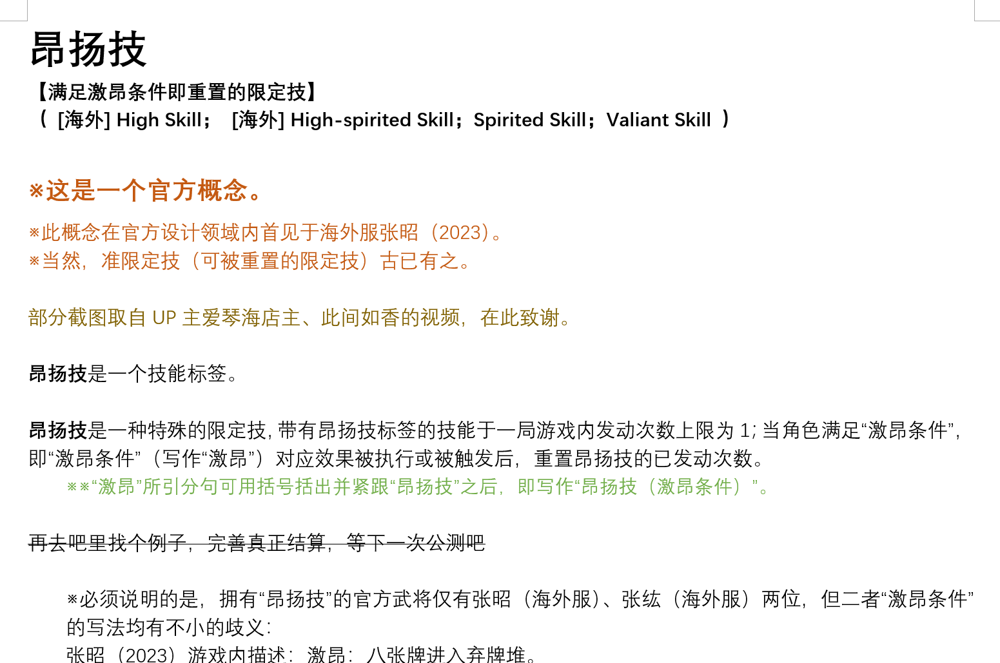

.. raw:: html

昂扬技
================
**【满足激昂条件即重置的限定技】**

   这是图片的标题。

**（ [海外] High Skill； [海外] High-spirited Skill；Spirited Skill；Valiant Skill ）**

- **这是一个官方概念。**
- 此概念在官方设计领域内首见于海外服张昭（2023）。
- 当然，准限定技（可被重置的限定技）古已有之。

部分截图取自UP主爱琴海店主、此间如香的视频，在此致谢。

**昂扬技**是一个技能标签。

**昂扬技**是一种特殊的限定技，带有昂扬技标签的技能于一局游戏内发动次数上限为1；当角色满足“激昂条件”，即“激昂条件”（写作“激昂”）对应效果被执行或被触发后，重置昂扬技的已发动次数。
* ※“激昂”所引分句可用括号括出并紧跟“昂扬技”之后，即写作“昂扬技（激昂条件）”。

再去吧里找个例子，完善真正结算，等下一次公测吧

- 必须说明的是，拥有“昂扬技”的官方武将仅有张昭（海外服）、张纮（海外服）两位，但二者“激昂条件”的写法均有不小的歧义：
	张昭（2023）游戏内描述：\underline{激昂：八张牌进入弃牌堆。}

	（一次性置入？累计置入？累计第八张牌以非同时进入的方式置入弃牌堆？）

	张纮游戏内描述：\underline{激昂：你弃置六张手牌。}

	（一次性弃置？累计弃置？一次性弃置六张牌且这些牌中至少六张为手牌？）

	还没意识到？现在我写一个描述--“激昂：造成3点伤害”，告诉我真正的检测条件？
	
	虽然我们可以通过从查询FAQ或理解线上游戏结算的方式反推技能效果，但显然是本末倒置之举：对玩家理解与游戏进程的干扰不谈，对于新概念的定义确立亦为大患。

- - 又按：至臻应变甚至附带了另两张概念卡“特意阐述”了昂扬技的概念与各武将的激昂条件，但还是没有解决这个历史遗留问题，评价为走心了但没完全走心。
- - 又又按：张昭（海外服新版）的“激昂条件”改为了：X张牌因弃置而进入弃牌堆（X为游戏人数），看来官方还没意识到这一问题。

- 先不说张昭张纮二人和应变有什么关系，就这还敢堂而皇之拿来当小牌盒的封面？

例1：张昭（海外服2023）〖力谏〗：**昂扬技，**其他角色的弃牌阶段结束时，你可以获得任意张此阶段弃置的牌，然后将其余的牌交给其，若其获得的牌多于你，你可以对其造成1点伤害。**激昂：**\underline{**累计**}八张牌置入弃牌堆。
例2：张纮（海外服）〖劝迁〗：**昂扬技**，出牌阶段限一次，你可以将至多四张花色各不同的手牌交给一名其他角色，若交出的牌数不小于2，则你从牌堆中随机获得一张装备牌。然后你选择一项：1.将手牌摸至与其手牌数相同；2.观看其手牌并选择一种花色，然后获得其所有此花色的手牌。**激昂**：你<strong style="text-decoration: underline">累计</strong>弃置六张手牌**（具体结算不明）**。

萨巴鲁酱按：“昂扬技”与“蓄势技”类似，可以理解为一种特殊的限定技，即“限定技，你执行技能效果；当激昂条件对应效果被执行或被触发后，重置此技能”。此外，“昂扬”一词语意明确且强烈，请慎用。对蓄势技的拙劣模仿。
又按：不难看出，三国杀里有一个同名技能〖激昂〗。我们似乎可以拿这两个字段做些什么…

庞英蓝按：“技能失效后仍能复原”的观感很诡异，因为技能复原条件（即重置触发节）亦包含于一些类型的限定技中（准限定技；也可以理解为昂扬技的另一种写法），且不能被“发动”的应是技能效果而非技能本身。故“限定技”不应被理解为“发动一次后技能失效”，而应援引官方规则集中的定义，即“于一局游戏内的发动次数上限为1”。“昂扬技”、“蓄势技”等亦如是。

   <strong style="text-decoration: underline">今天天气很好</strong>